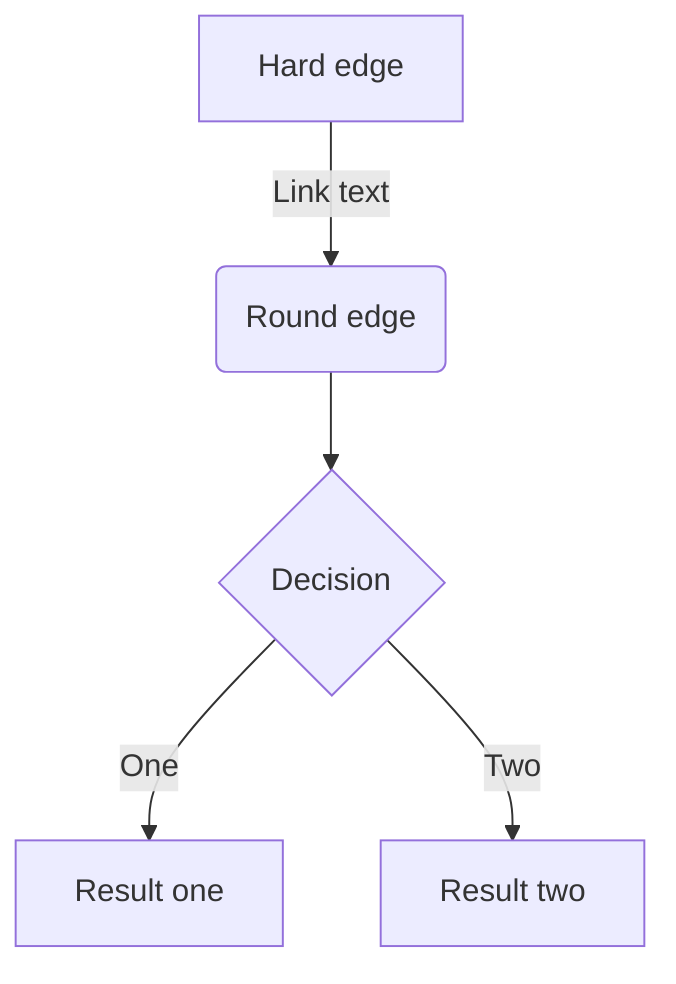
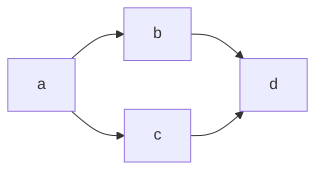

# 埋め込みコンテンツ

https://twitter.com/okyawa

https://www.instagram.com/p/CkKZB0fr-Zt/

https://flic.kr/p/2nTU4b2

https://www.youtube.com/watch?v=WRVsOCh907o

# コード

```ts
import mh2 from 'zenn-markdown-html';

export default async function markdownToHtml(markdown: string) {
  return mh2(markdown)
}
```

# メッセージ

:::message
メッセージをここに
:::

:::message alert
警告メッセージをここに
:::

# KaTeXによる数式

$$
e^{i\theta} = \cos\theta + i\sin\theta
$$

# 見出し

```
# 見出し1
## 見出し2
### 見出し3
#### 見出し4
```

# リスト

```
- Hello!
- Hola!
  - Bonjour!
  * Hi!
```

- Hello!
- Hola!
  - Bonjour!
  * Hi!

## 番号付きリスト

```
1. First
2. Second
```

1. First
2. Second

# ダイアグラム



# フローチャート

